# Pawr Sale Website

A website developed for the completion of the subject, System Integration Architecture.

**_The Project Requirement_**
   1. Develop a website which contains a product page with 3 items listed and a shopping cart.
   2. You may either utilize a either a database or via sessions for the products and the cart. 
   3. Upon a successful checkout, the user must receive an email containing the following: the user's last name, total price, and details regarding the product/s purchased.
   4. Utilize an integration platform such as Make (_formerly Integromat_) to send the email and/or integrate Stripe or Sandbox.
   5. Use Stripe or Sandbox for the payment processing wherein credit card is the only available method.
   6. The payment processing must only accept valid credit cards.

---

**_The Created Project_**
   * The website contains the following primary pages accessible via the header: Landing/Home, About Us, Contact Us, and Products. As well as a pop-up shopping cart.
   * The website utilizes sessions and cache for the listing of products and the optimization of loading speed.
   * The displayed products in the Products page are automatically populated via the items listed in the Products Catalog from the Stripe Dashboard.

---

**_How to use_**

Before proceeding the user must have already prepared:

- A Stripe account with items registered in the "Products Catalog" of Stripe.
- A chosen Integration platform with a webhook such as Integrately.

After preparing the needed components:
1. Grab the Secret Key from the Stripe dashboard.
2. Insert the Secret Key to the following pages with the `$stripe_secret_key` variable located in these pages:
    * add_to_cart.php
    * cart.php
    * checkout.php
    * product_details.php
    * success.php
    * update_cache.php
    * update_cart_cache.php
    * update_cart.php
3. Insert the webhook key from the Integration platform to the `$integratelyWebhook` variable located in success.php
4. Go to your the website.

---

**_Disclaimer & Credits_**
* I do not own the images used in this project. If you are the owner of any of the photos and would like them to be credited or removed, please contact me.
* Credits to https://www.freepik.com/author/catalyststuff for the images used in the banner on the Products Page, Successful & Unsuccessful Payment page.
* Credits to https://startbootstrap.com/theme/new-age for the Bootstrap theme used in this project.

---

# Preview Images

### Landing Page

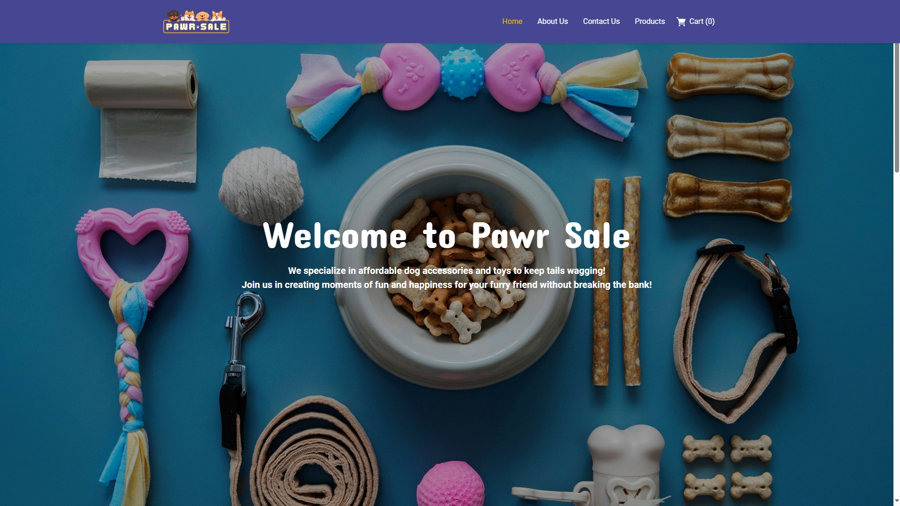

### About Us

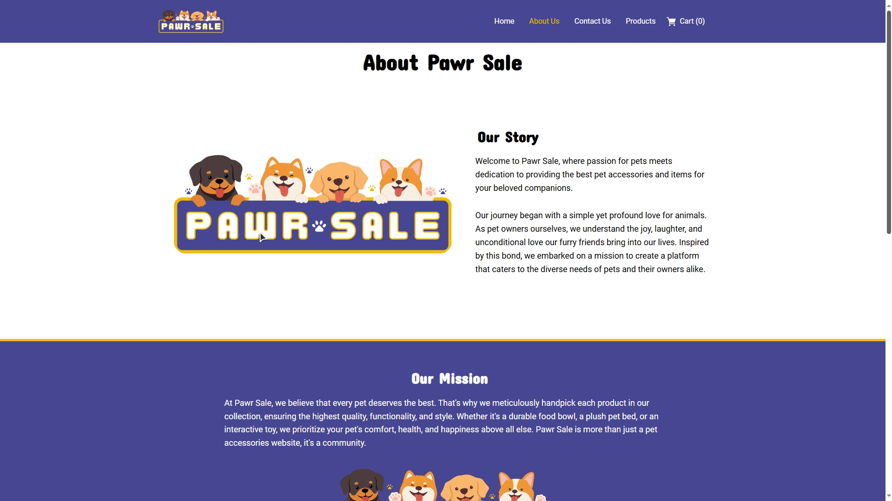

### Contact Us

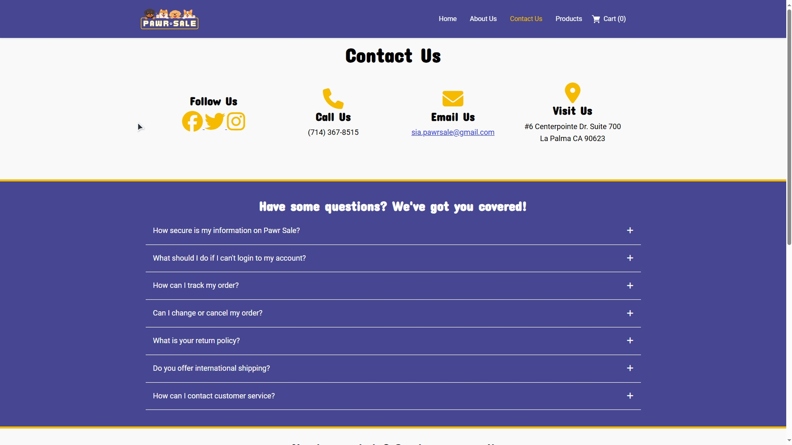

### Products Page

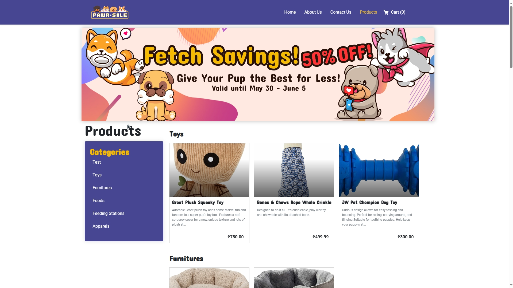

### View Product Card

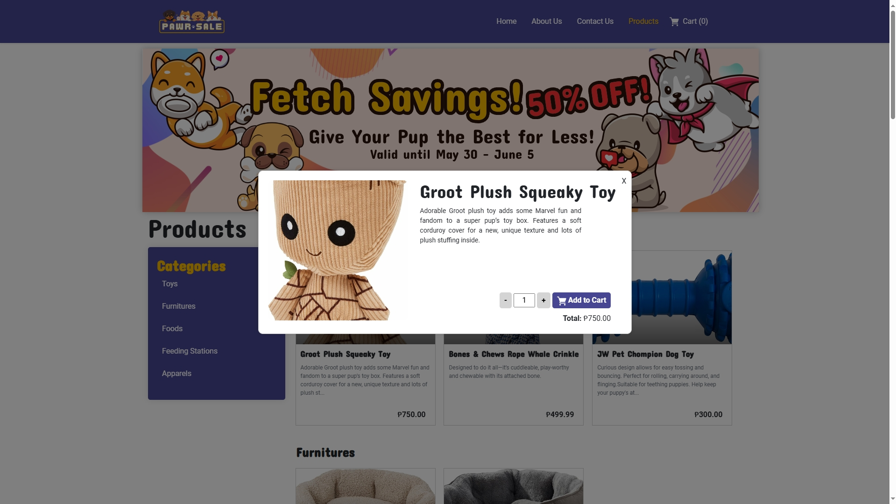

### Pop-up Cart

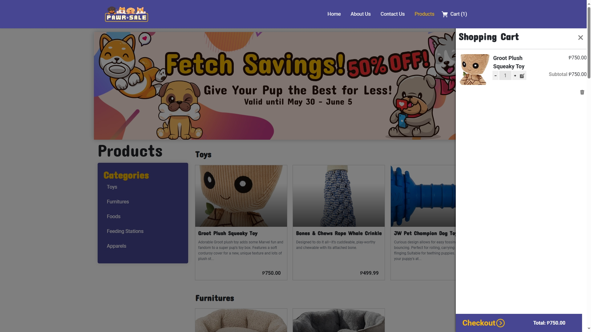

### Checkout Page

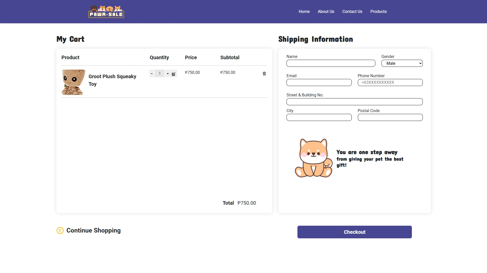

### Payment Page

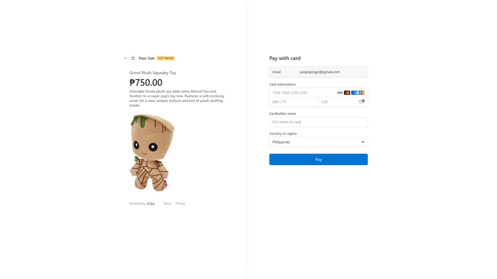

### Successful Payment

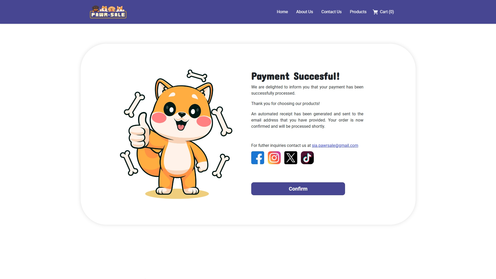

### Unsuccessful Payment

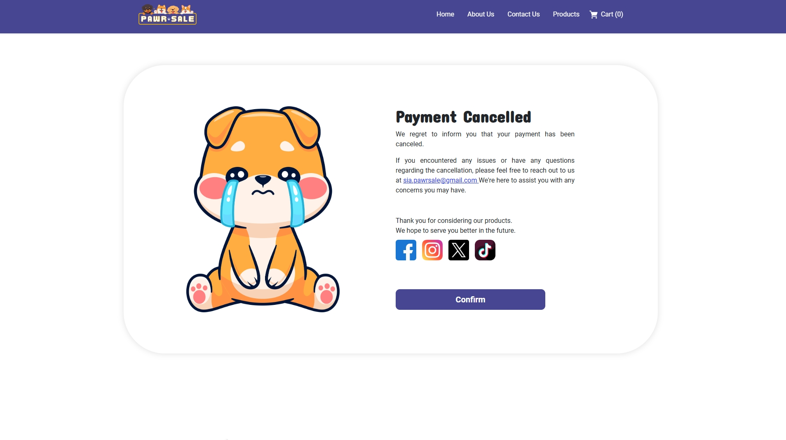

### Receipt (sent in Email)

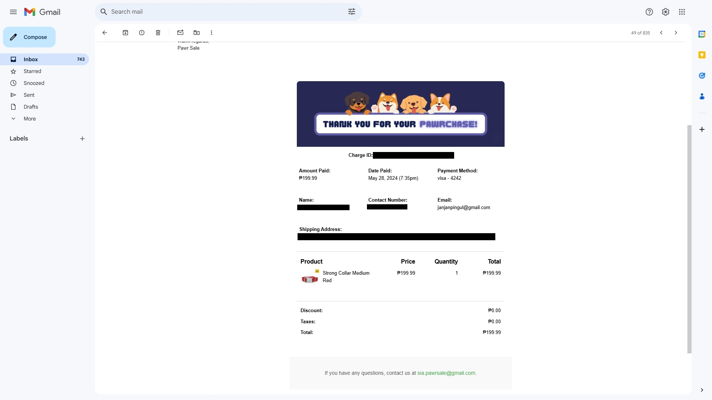
